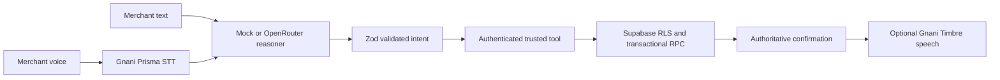

# Stage 12 engineering review

This review covers local source and automated tests on 10 October 2026. It does not claim live Gnani, OpenRouter, or Supabase calls were made during this visual study.

The provider key is read server side. The assistant turn route validates model output before tool execution and constructs its reply from the tool result. TTS failure does not turn a failed business action into a success. A mock reasoner remains the default. Visual Core states in this prototype are explicitly simulated.

| Area | Evidence and current position |
| --- | --- |
| Transaction safety | `record_sale` locks products and writes sale, items and movement in one PostgreSQL function. `transition_purchase_order` locks the order; receive increases stock inside the same function and stale transitions fail. Local migration tests cover failed sale rollback and ownership. |
| Idempotency | Mutating assistant and business POSTs have no durable request ID. A network retry after a completed sale, ledger entry, or stock change could duplicate the action. Add a shop-scoped idempotency key and unique constraint before public release. |
| Rate limits | Audio has a 1 MB and 15-second cap; images are limited to three at 5 MB each; text length is bounded. There is no durable per-user request or provider-credit rate limit. Add one before public access. |
| Provider failures | STT, reasoning, vision, and TTS errors return controlled responses; failed tool results are never described as successful. A read failure after a successful write can leave confirmation uncertain, so the UI directs the merchant to check recent records before retrying. |
| Privacy | Attachments are processed in memory and not stored by this route. Voice and vision data can be sent to configured providers; production consent and retention notices need review before public launch. `.env.local` remains ignored. |
| Loading states | Workspace and assistant provide loading and error states. The preview's WebGL and glass effects load only on capable desktop; a static faceted core remains during load and as fallback. |

## SEO preparation

The Next.js landing now has route-specific title, description, Open Graph image, SoftwareApplication JSON-LD, and semantic headings. Sign-in and workspace have `noindex`. `robots.txt`, sitemap, and canonical URL are enabled for the landing only after an approved `NEXT_PUBLIC_SITE_URL` HTTPS origin is set. This avoids publishing a localhost canonical URL. The current project has no approved public domain, so local production output correctly blocks indexing.

This follows the technical audit categories from the [Claude SEO repository](https://github.com/AgriciDaniel/claude-seo): crawlability, indexability, metadata, structured data, sitemap, and Core Web Vitals. Its Claude Code commands were not run. Search found existing products at [dukaansaathi.com](https://www.dukaansaathi.com/) and [dukaansathi.in](https://dukaansathi.in/), making brand and domain review necessary before opening indexing. No rename was made.

Local Lighthouse lab results after the segmented Core revision: prototype desktop performance **93**, accessibility **100**, SEO **100** (LCP 1.2 s, CLS 0.001, TBT 0 ms); prototype mobile performance **96**, accessibility **100**, SEO **100** (LCP 1.8 s, CLS 0, TBT 100 ms). The preceding prototype scored **84** desktop and **97** mobile; the one-point mobile difference is within ordinary lab-run variability. The current production landing measured performance **84**, accessibility **95**, SEO **63**; its crawlability audit fails by design while no approved public origin is configured. These are local lab measurements, not field Core Web Vitals or ranking evidence.

## 60-second real-demo plan

1. **0–10s:** Open the current signed-in Demo Shop; identify the voice-first command center.
2. **10–25s:** Speak “Maggi ke 20 packet add kar do.” Show transcription, structured intent, trusted stock update, then refreshed inventory. Use a real result only.
3. **25–38s:** Ask “Sharma ji ka kitna udhaar hai?” Show the ledger-derived amount and optional spoken reply.
4. **38–50s:** Upload a synthetic shopping list; show a draft with availability and price. Confirm a sale only after explicit action, then show reduced stock.
5. **50–60s:** Show today’s sales and reorder suggestions. Close on the theme and Core visual, clearly identifying the visual sequence as illustrative.

Keep provider calls short and avoid running the reset action during a live demo. Prepare a local mock-mode recording as a fallback if an external provider is unavailable.
